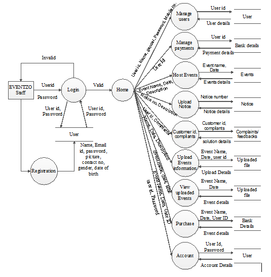
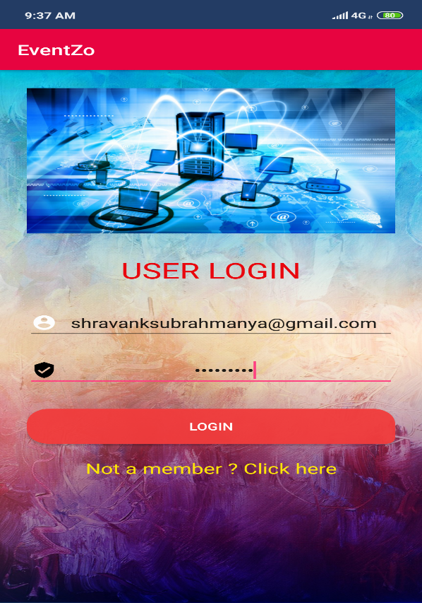
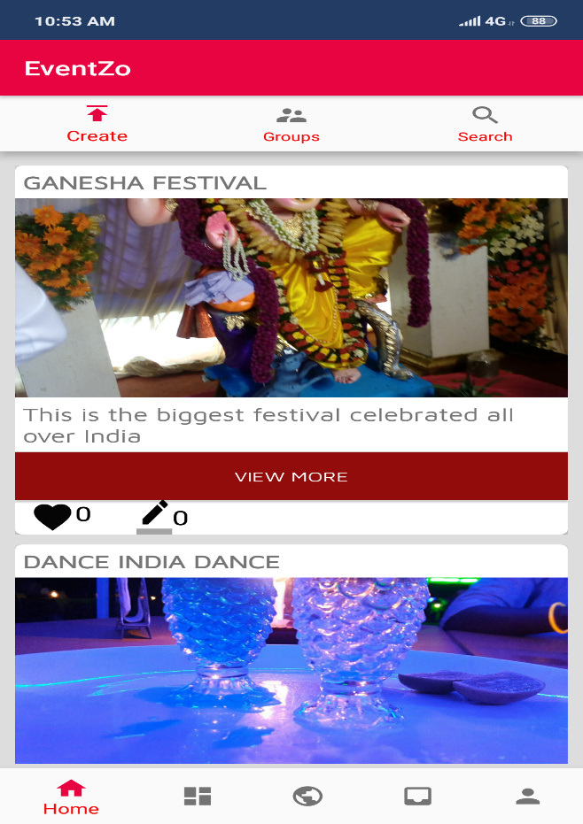
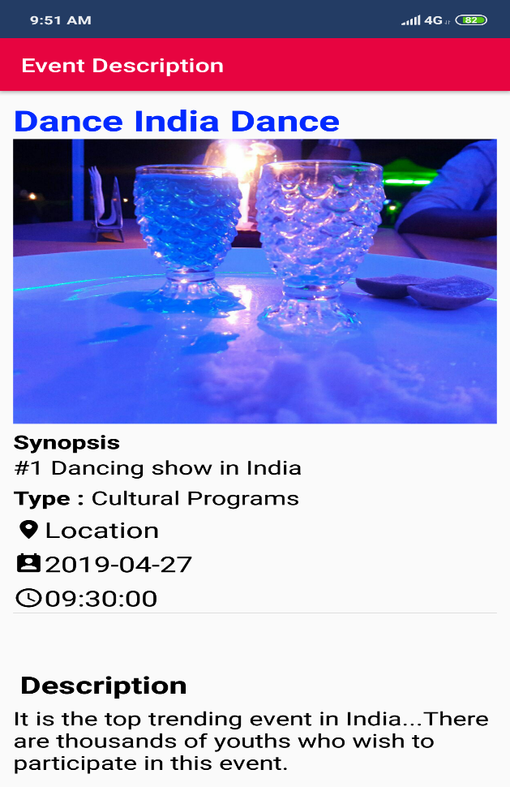

# Online-Events-Tickets-Sellling-App

## Application Title - EVENTZO
This is the media which will connects to all the type of social events and contains information about them. It will allow the person to book tickets for a particular event hosted by another user or organizations.
In the EVENTZO application we notice the public about all the type of events. And also allow them to upload the information about the particular Event, in which they are participating or watching. EVENTZO is an application which lets the user to get the information (live messages, complete description, video link and articles etc.), about all the type of Events (Sports, Competitions, Social Events and Awarding functions etc.) which takes place everywhere.  Here a user can connect with another user to send and notifications to each other.

### Software Requirements:
* Android Studio
* WampServer
* Sublime Text

### Languages Used:
* Front – end: 
  * XML
  * Java
* Back- End: 
  * Server sided scripting - PHP
  * MySQL 
  
 ### DFD Diagram:
 
 
 ### Screenshots:
 #### Login Page:
  
 
 #### Home Page:
  
 
 #### Event Details:
  
